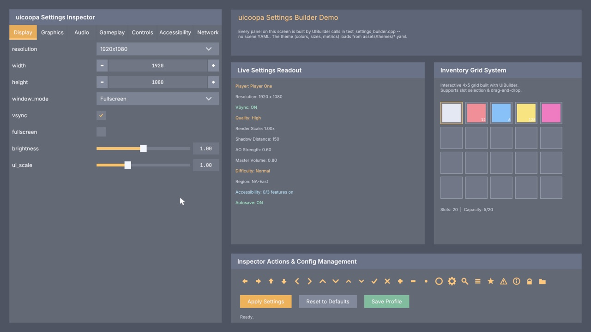
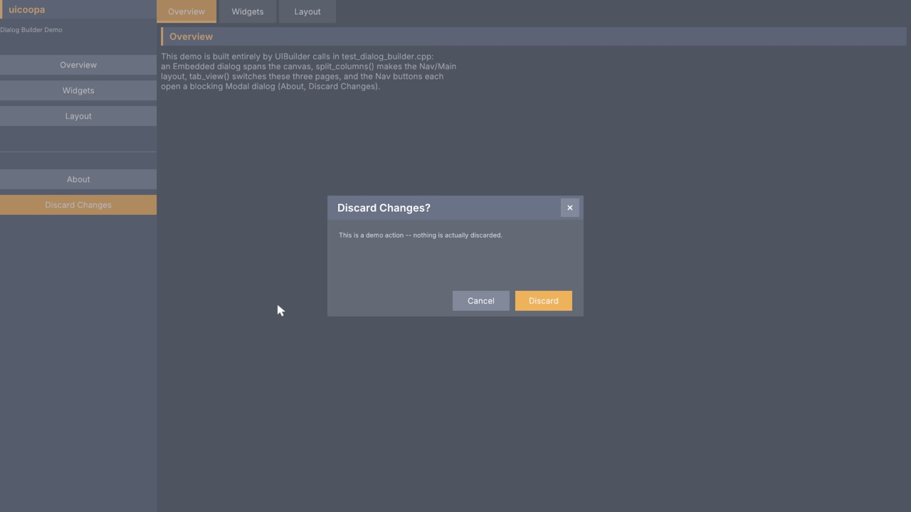
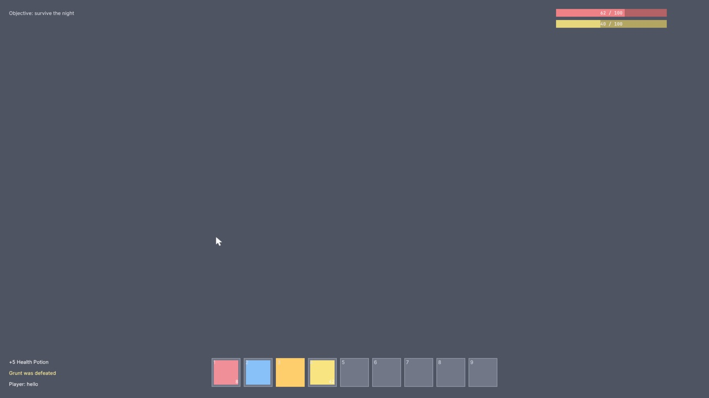
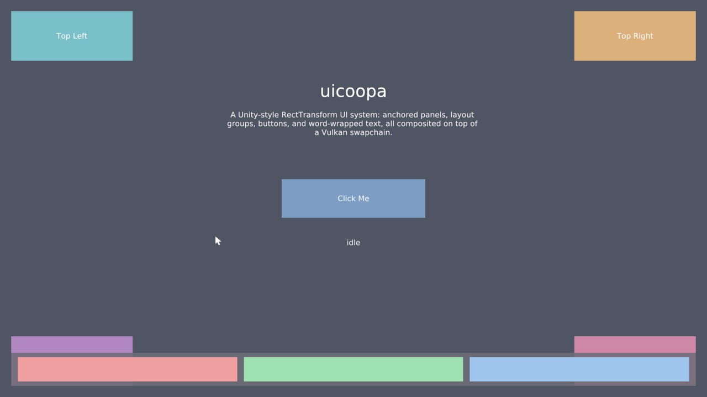
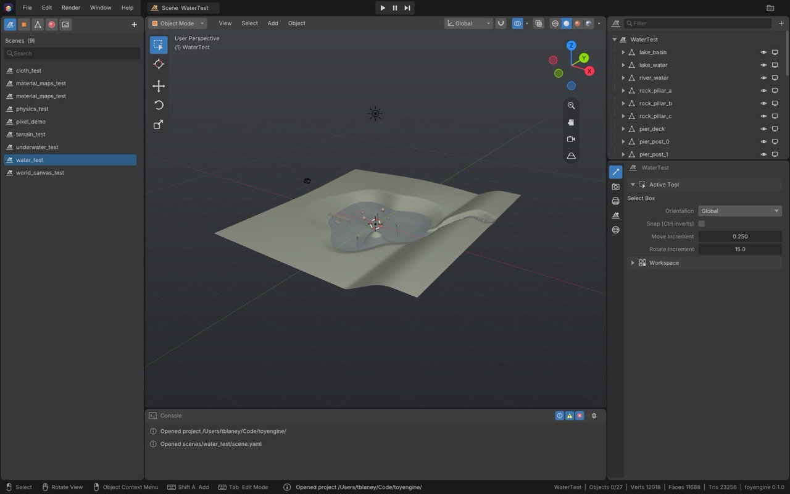

# uicoopa

**A C++20 game UI library: anchored retained widgets, a fluent builder, and an immediate-mode layer for tools.**

uicoopa is a header-only UI toolkit that renders through Vulkan. Game UI is built from
Unity-style `RectTransform` nodes with layout groups, text, and interactive widgets, either
from YAML scenes or with a fluent C++ builder. Tool UI (editors, debug panels) uses an
immediate-mode API that draws through the same renderer. The UI composites into a render
pass the host has already opened, so it layers over an existing 3D frame. Canvases can be
screen-space or placed in the 3D world.



<table>
  <tr>
    <td></td>
    <td></td>
  </tr>
  <tr>
    <td align="center"><sub><b>dialog_builder</b>: split columns, tabs, a blocking modal</sub></td>
    <td align="center"><sub><b>hud_builder</b>: stat bars, message log, hotbar bound to game data</sub></td>
  </tr>
  <tr>
    <td></td>
    <td></td>
  </tr>
  <tr>
    <td align="center"><sub><b>test_window</b>: a UI declared entirely in scene YAML</sub></td>
    <td align="center"><sub>the <a href="https://github.com/cooparobla/toyengine">toyengine</a> editor, built entirely on the immediate-mode layer</sub></td>
  </tr>
</table>

## Features

### Layout
- **Anchored rects.** `RectTransform` uses Unity's model: anchors, pivot, anchored position
  and size delta, with named presets such as `TopLeft` and `StretchAll`.
- **Explicit layout passes.** `CanvasComponent` runs measure, arrange and emit each frame,
  so layout groups know their children's sizes before they are placed.
- **Layout groups.** Horizontal, vertical and grid groups, `LayoutElement` size overrides,
  `ContentSizeFitter`, and `ScrollRect` with clamped or elastic scrolling.
- **Resolution scaling.** `CanvasScaler` scales from a reference resolution.
- **World-space canvases.** A canvas can billboard toward the camera or follow a 3D
  transform. Every widget works unchanged there, including clicks via a pointer ray.

### Widgets
- **Basics.** `Image` (solid, sprite, or 9-sliced), `Text` (wrap, truncate, alignment), and
  `Mask` clipping.
- **Controls.** `Button`, `Toggle`, `Slider`, `Scrollbar`, `NumberField`, `SpinBox`,
  `TextField`, `ComboBox`, `TabView`, `CollapsiblePanel`, and `MenuBar`.
- **Overlays.** Modal and windowed dialogs, file open/save dialogs, tooltips, and a themed
  software cursor.
- **Gameplay HUD.** `ProgressBar` with a damage trail, `MessageLog`, `InventoryGrid` with
  drag and drop, a hotbar, and a backtick dev `Console`. Bars and grids can bind to libcoopa's
  `coopa::stat` and `coopa::item` models.
- **Gamepad navigation.** A focus ring with directional search, button-prompt bars, and a
  hybrid mode that switches between mouse and pad on the last input.

### Building UI
- **`UIBuilder`.** A fluent, theme-driven API: panels, cards, scroll views, split rows and
  columns, tabs, dialogs, and labelled settings rows. Read or write any widget's value by
  name with `get_value<T>()` / `set_value()`.
- **Themes.** `UITheme` groups styles per widget family. Dark and light themes ship as YAML,
  with per-role fonts (title, body, numeric, and more).
- **YAML scenes.** `register_ui_components()` lets scene files declare every widget, with
  prefab-style `inherit_from`.
- **Signals and reactors.** Widgets emit `coopa::event::Signal`s and publish to the scene's
  event bus. Reactor components (`SetActiveOnSignal`, `ColorOnSignal`, `TextOnSignal`, ...)
  respond from YAML with no C++ wiring.
- **UI sound.** Optional. `UiSoundPlayer` adds hover and click sounds to every widget under
  it.
- **Animation.** `RectTransform` and graphic colour fields are registered as animatable
  properties for libcoopa's animator.

### Immediate mode
- **`imm::Context`.** Menus, popups, modals, trees, property rows, drag fields, text input,
  a colour picker, splitters, and drag and drop, re-declared every frame from your data.
- **Built-in vector icons** and YAML themes with inheritance.
- **`imm::FileDialog`** (`immediate/imm_file_dialog.h`). A Finder-style Open / Save / Choose
  Folder modal. It has back / forward / up buttons, a clickable path bar with live search,
  Favorites / Recent / Locations in a sidebar, a sortable Name / Date / Size / Kind list, a
  Format menu, full keyboard navigation, and Finder-style New Folder with in-place rename. An
  app names its own document kinds and adds its own Favorites.
- **Searchable combos.** `combo()` lists longer than 15 items get a type-to-filter field.
- **`ImmediateCanvas`** hosts it inside a normal screen-space canvas.

## Dependencies

uicoopa expects its sibling libraries to be checked out next to it, in the same parent
folder. `CMakeLists.txt` pulls them in as follows:

| Library | How | Used for |
|---|---|---|
| [gfxcoopa](../gfxcoopa) | required, `add_subdirectory` | Vulkan rendering: `UiPass`/`UiWorldPass` build on its `TexturedQuad2DPass`, and textures and font atlases are its images. Direct includes are limited to `uicoopa/render/` and `uicoopa/text/`, but widgets reach it through `DrawList`. The demos also use its window and app context. |
| [libcoopa](../libcoopa) | required, brought in by gfxcoopa | The scene graph every widget lives in, signals and event bus, input, YAML, assets, and the `item`/`stat` models the HUD widgets bind to. |
| [sfxcoopa](../sfxcoopa) | optional, `UICOOPA_WITH_AUDIO` (ON) | UI sound in `uicoopa/audio/` only. If the folder is missing, uicoopa builds without audio and prints a warning. |
| [caml](../caml) | include path only | `CMakeLists.txt` adds its `includes/` (fkYAML) to the include path. No uicoopa header includes a caml header directly. |

You also need the Vulkan SDK (with `glslc`), GLFW, CMake 3.20+ (gfxcoopa's shader rules need
it) and a C++20 compiler. stb_truetype is vendored in `includes/`.

## Getting started

### 1. Clone

Clone uicoopa and its siblings into one folder. gfxcoopa has a nested submodule, so clone it
recursively:

```bash
mkdir coopa && cd coopa
git clone git@github.com:cooparobla/uicoopa.git
git clone --recurse-submodules git@github.com:cooparobla/gfxcoopa.git
git clone git@github.com:cooparobla/libcoopa.git
git clone git@github.com:cooparobla/sfxcoopa.git   # optional, for UI sound
git clone git@github.com:cooparobla/caml.git
```

### 2. Build

```bash
cd uicoopa
cmake -B build && cmake --build build -j
```

### 3. Run the demos

```bash
./build/uicoopa_settings_builder   # tabbed settings inspector built with UIBuilder
./build/uicoopa_dialog_builder     # split layout, tabs, modal dialogs
./build/uicoopa_hud_builder        # gameplay HUD: stat bars, hotbar, log, console (`)
./build/uicoopa_gamepad_builder    # pad navigation with arrow keys / WASD; F10 quits
./build/uicoopa_test_window        # a UI declared entirely in YAML
```

Esc quits (F10 in the gamepad demo). Each demo writes a screenshot of its last frame to
`output/<name>.png`. `MAX_FRAMES=<n>`, `ONESHOT=1`, `THEME=light` and `UI_AUDIO=0` help with
scripted runs; the [reference](docs/reference.md#running-a-demo) lists every variable.

### 4. Build a UI in code

This is an abridged version of `test_dialog_builder.cpp`. It builds a canvas with
`UIBuilder`, then draws it each frame with `UiPass` inside gfxcoopa's frame loop.

```cpp
#include <gfxcoopa/app/context.h>
#include <uicoopa/layout/canvas.h>
#include <uicoopa/render/ui_pass.h>
#include <uicoopa/text/font.h>
#include <uicoopa/text/font_defaults.h>
#include <uicoopa/builder/ui_builder.h>
#include <uicoopa/ui_yaml.h>          // UIResourceCache
#include <coopa/scene/scene.h>

using namespace coopa::ui;
using coopa::scene::Scene;
using coopa::scene::SceneObject;

coopa::gfx::app::Context ctx(coopa::gfx::app::ContextConfig{.title = "my ui", .width = 1280, .height = 720});
UiPass ui_pass(ctx.device(), ctx.allocator(), ctx.command_pool(), ctx.render_pass(),
               "assets/shaders/ui.vert.spv", "assets/shaders/ui_quad.frag.spv",
               "assets/shaders/ui_text.frag.spv");

Font font(ctx.device(), ctx.allocator(), ctx.command_pool(), "assets/fonts/DejaVuSans.ttf");
FontDefaults::font = &font;
const UITheme theme = UITheme::builtin_dark();

Scene scene("ui");
auto canvas_obj = std::make_unique<SceneObject>("Canvas");
auto* canvas = canvas_obj->add_component<CanvasComponent>();
canvas->scaler.mode = ScaleMode::ScaleWithScreenSize;
canvas->scaler.reference_resolution = {1280.0f, 720.0f};

UIBuilder root(canvas_obj.get(), &theme);
UIBuilder card = root.card("Settings", "Preferences", AnchorPreset::TopLeft, {20, -20}, {400, 300});
card.add_toggle_row("vsync", true);
card.add_slider_row("volume", 0.0f, 1.0f, 0.8f);
card.add_button("Apply", ButtonRole::Primary, [&] {
    bool vsync = card.get_value<bool>("vsync");   // read back by name
    // ...
});

scene.add_root_object(std::move(canvas_obj));
scene.start();                                    // after the whole UI is built
canvas->set_default_texture(ui_pass.white_view());

while (!ctx.should_close()) {
    ctx.poll();
    auto [w, h] = ctx.window().framebuffer_size();
    canvas->set_viewport(w, h);
    canvas->set_input(ctx.input());
    scene.update(ctx.delta_time());
    scene.late_update(ctx.delta_time());          // layout, input and emit happen here

    UIResourceCache::instance().mark_text_atlases(ui_pass);   // glyph atlases are R8 coverage
    ui_pass.register_textures(canvas->draw_list());
    ui_pass.begin_frame(ctx.current_frame(), canvas->draw_list().vertices().size(),
                        canvas->draw_list().indices().size());
    coopa::gfx::app::FrameCallbacks cb;
    cb.record = [&](coopa::gfx::command::CommandBuffer& cmd) {
        ui_pass.draw(cmd, ctx.current_frame(), w, h, canvas->scale_factor(), canvas->draw_list());
    };
    ctx.frame(cb);
}
```

The full demo also loads icon sheets, theme files with per-role fonts, and audio, and saves
a screenshot on exit. Copy its `main()` as a starting point.

### 5. Or declare it in YAML

Register the YAML parsers once, then load the scene with libcoopa's `SceneManager`, as
`test_window.cpp` does:

```cpp
coopa::ui::register_ui_components(ctx.device(), ctx.allocator(), ctx.command_pool());
coopa::scene::SceneManager scenes;
scenes.load_scene("assets/scenes/hello/scene.yaml");
```


```yaml
format: uicoopa
scene:
  scene_name: hello
  root_objects:
    - name: Canvas
      components:
        - type: Canvas
          reference_resolution: { x: 1280.0, y: 720.0 }
      children:
        - name: Panel
          components:
            - type: RectTransform
              anchor_preset: TopLeft
              anchored_position: { x: 20.0, y: -20.0 }
            - type: Image
              color: { r: 0.20, g: 0.55, b: 0.60, a: 0.95 }
```

[`assets/scenes/test_window/scene.yaml`](assets/scenes/test_window/scene.yaml) is a complete,
commented example with layout groups, a button and reactors.

## Use it in your project

```cmake
add_subdirectory(path/to/uicoopa ${CMAKE_CURRENT_BINARY_DIR}/uicoopa-build)
target_link_libraries(myapp PRIVATE coopa::gfx coopa::ui)   # coopa::ui after coopa::gfx
add_dependencies(myapp uicoopa_shaders)                      # compiles the UI shaders
```

`coopa::ui` carries the include paths, links gfxcoopa (and sfxcoopa when audio is on), and
adds a small static library for stb_truetype. The demos, tests and leak check are only
built when uicoopa is the top-level project.

## Testing

```bash
ctest --test-dir build        # the headless suite plus the no-raw-Vulkan check
./build/uicoopa               # the suite on its own
```

`test.cpp` holds about 200 assertion tests covering layout math, text wrapping, raycasting,
YAML parsing, the builder, dialogs, navigation, and the HUD bindings. It needs no window or
GPU. `GFX_LEAK_CHECK` (ON by default) also fails the build if library code names a raw
Vulkan or GLFW symbol.

## Project layout

```
uicoopa/
├── layout/      RectTransform, CanvasComponent, CanvasScaler, LayoutElement
├── groups/      layout groups, grid, ContentSizeFitter, ScrollRect
├── widgets/     Image, Text, Button, Slider, ..., dialogs, HUD widgets, console
├── input/       raycaster, event system, focus, modal stack, drag and drop, gamepad nav
├── render/      DrawList, UiPass, UiWorldPass, sprites, sprite sheets, icon library
├── text/        Font, FontAtlas (stb_truetype)
├── builder/     UIBuilder, UITheme, ThemeLibrary; one detail/ header per concern
├── reactors/    YAML-declared responses to signals
├── audio/       optional UI sound (sfxcoopa)
├── binding/     UiHandle: bind game code to named widgets in authored UI
├── immediate/   imm::Context, ImmediateCanvas, icons, themes, FileDialog
└── ui_yaml.h    register_ui_components()
assets/          shaders, fonts, themes, icon sheets, sounds, demo scenes and prefabs
src/             ui_impl.cpp: the one compiled file (stb_truetype)
tools/           scripts that generate the icon, cursor and button-prompt sheets
test*.cpp        the headless suite and the five windowed demos
```

## Notes

- **Shaders build in place.** `uicoopa_shaders` writes `.spv` and `.spv.d` files next to the
  sources in `assets/shaders/`, and the `.spv` files are committed. A build can therefore
  touch tracked depfiles; `git checkout -- '*.spv.d'` restores them.
- **Destroying a texture.** Call `UiPass::unregister_texture(view)` before destroying a
  texture the UI has drawn. Its caches are keyed by image-view handle, and drivers reuse
  freed handles.
- **`Scene::start()` timing.** Dialogs and tab views apply their initial visibility in
  `start()`. Build the whole UI first, then start the scene once. UI built later needs its
  own `start()` call.
- **Windows.** The demos open a visible window. gfxcoopa's `ContextConfig::visible = false`
  gives a never-mapped window for automated captures.

## Documentation

- [docs/reference.md](docs/reference.md): the per-header guide. It covers world-space
  canvases, every widget, the builder (splits, dialogs, tabs, menus, file dialogs, HUD),
  themes and the cursor, reactors, audio, YAML and animatable properties, gamepad
  navigation, the immediate-mode layer, every demo and environment variable, and build
  details.
- The headers are documented in Doxygen style. With `coopadocs` installed, `coopadocs build`
  generates the HTML API reference.
